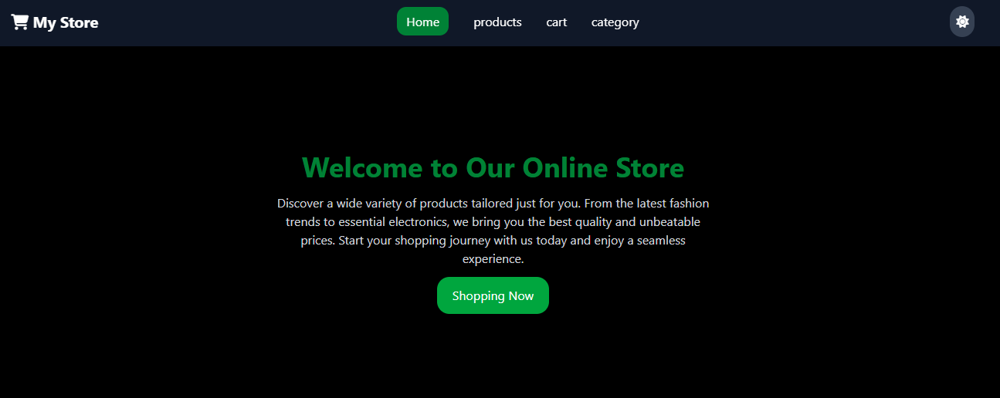
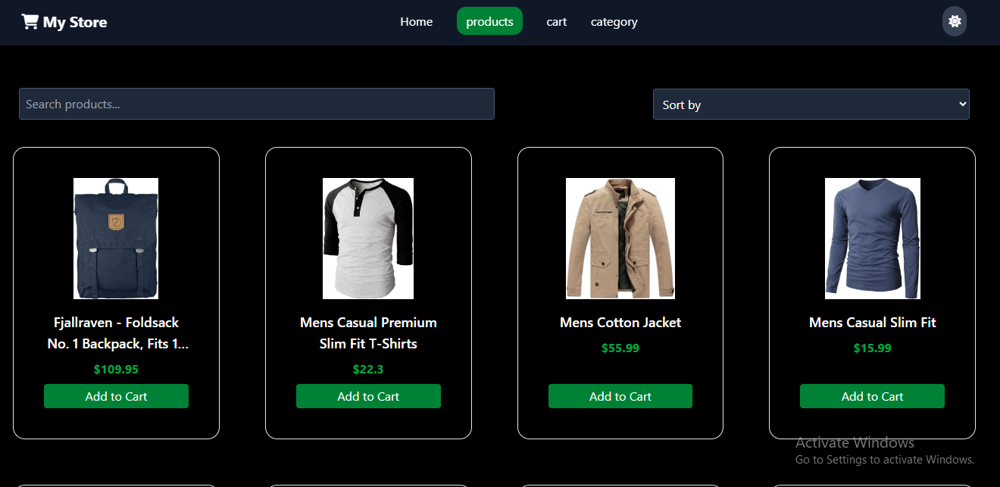
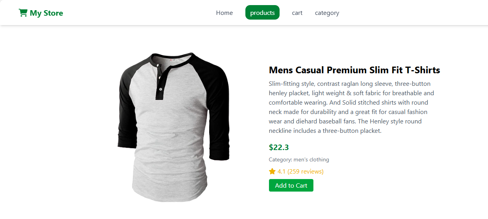
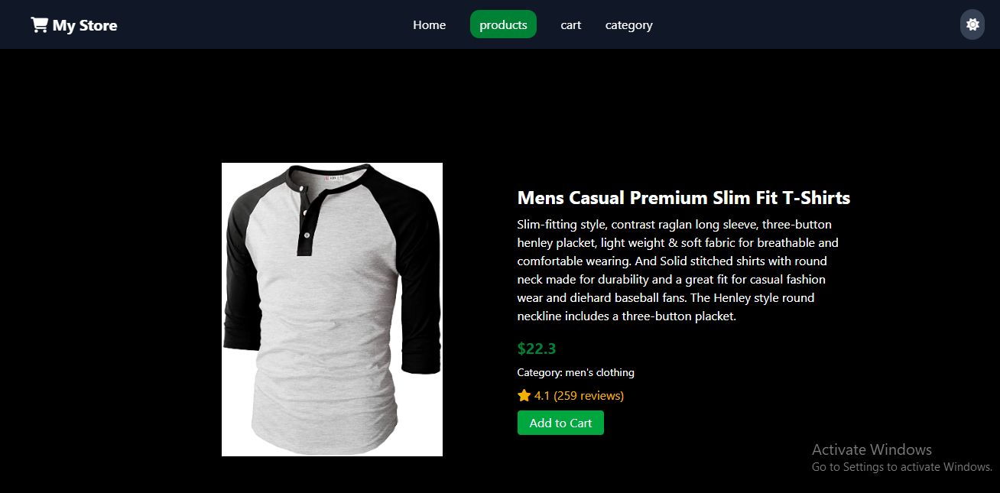
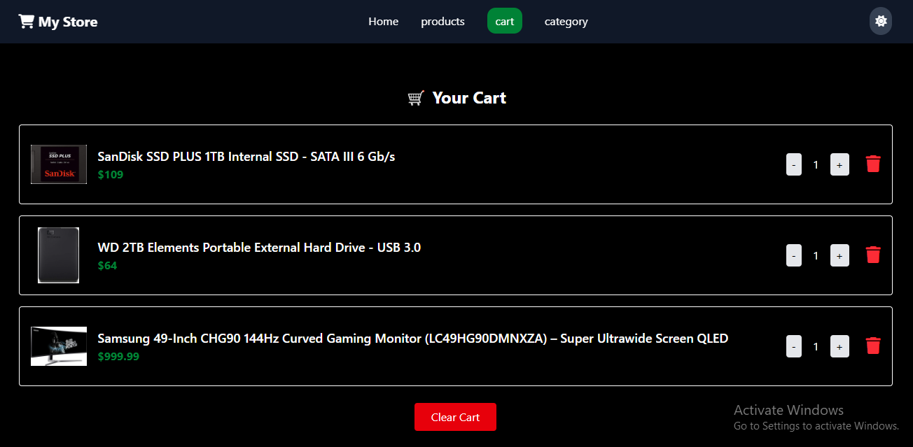
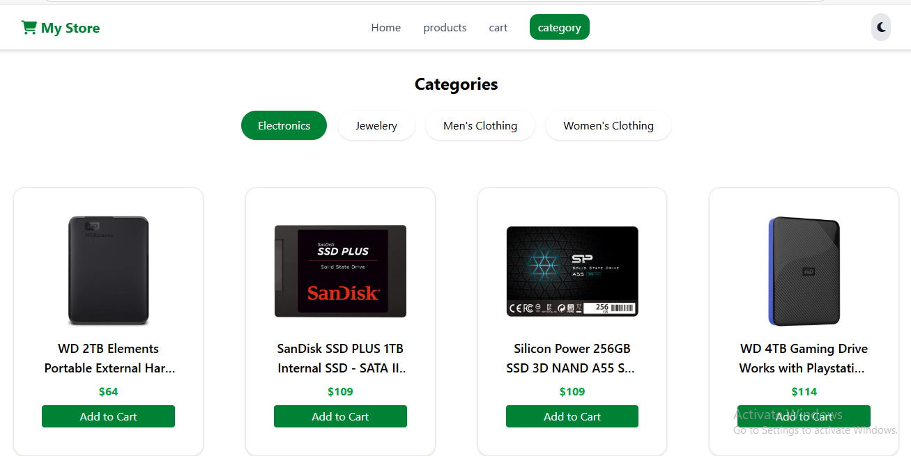
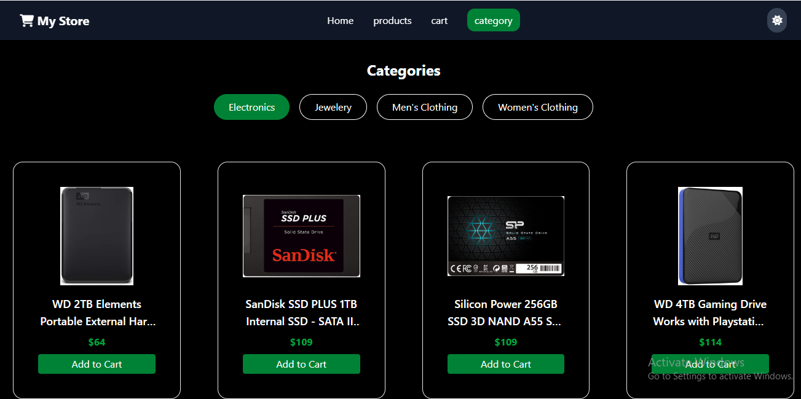

# 🛍️ My E-commerce Project

## 📝 Project Overview

This is a simple and responsive e-commerce web application built with React and Tailwind CSS.  
Users can browse products, filter and sort them, view detailed information, and manage a shopping cart — all with a clean, modern UI.

✨ **Key Features**:
- 🌗 Light & Dark Mode toggle for better user experience.
- 🛒 Add to Cart functionality with local storage.
- 🔍 Product filtering and sorting.
- ⏳ Loading indicators for smoother navigation.
- 📱 Fully responsive layout for all screen sizes.

## 🖼 Screenshots

### 🏠 Home Page

### 🛒 Product Details

### 🛍️ Cart Page

### 🛍️ Category Page

## 🧱 Tech Stack Used

- ⚛️ **React.js** – JavaScript library for building user interfaces
- 🚀 **Vite** – Frontend tooling for fast development and builds
- 🎨 **Tailwind CSS** – Utility-first CSS framework for styling
- 🛒 **Fake Store API** – Mock API used for fetching product data
- 💾 **React Context API** – Used for managing cart state locally
- 🧭 **React Router DOM** – For client-side routing
- 📦 **Font Awesome** – For beautiful icons
